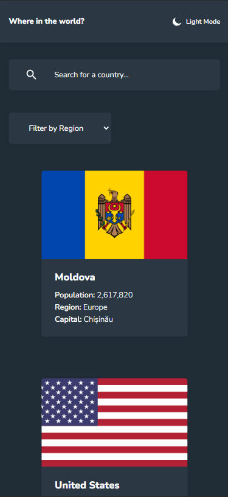

# Frontend Mentor - REST Countries API with color theme switcher solution

Hi! I'm Eva. Thank you for deciding to familiarize yourself with my solution of one of the Frontend Mentor challenges.

This is a solution to the [REST Countries API with color theme switcher challenge on Frontend Mentor](https://www.frontendmentor.io/challenges/rest-countries-api-with-color-theme-switcher-5cacc469fec04111f7b848ca). Frontend Mentor challenges help you improve your coding skills by building realistic projects. 

## Table of contents

- [Overview](#overview)
  - [The challenge](#the-challenge)
  - [Screenshot](#screenshot)
  - [Links](#links)
- [My process](#my-process)
  - [Built with](#built-with)
  - [What I learned](#what-i-learned)
  - [Continued development](#continued-development)
  - [Useful resources](#useful-resources)
- [Author](#author)
- [Acknowledgments](#acknowledgments)

## Overview

### The challenge

[Brief](https://www.frontendmentor.io/challenges/rest-countries-api-with-color-theme-switcher-5cacc469fec04111f7b848ca):
"Users should be able to:

- See all countries from the API on the homepage
- Search for a country using an input field
- Filter countries by region
- Click on a country to see more detailed information on a separate page
- Click through to the border countries on the detail page
- View the optimal layout for the interface depending on their device's screen size
- See hover and focus states for all interactive elements on the page
- **Bonus:** Toggle the color scheme between light and dark mode".

### Screenshot

Design:

  Light theme:
  - [Desktop main page]('design/desktop-design-home-light.jpg')
  - [Mobile main page]('design/mobile-design-home-light.jpg')
  - [Desktop detail page]('design/desktop-design-detail-light.jpg')
  - [Mobile detail page]('design/mobile-design-detail-light.jpg')

  Dark theme:
  - [Desktop main page]('design/desktop-design-home-dark.jpg')
  - [Mobile main page]('design/mobile-design-home-dark.jpg')
  - [Desktop detail page]('design/desktop-design-detail-dark.jpg')
  - [Mobile detail page]('design/mobile-design-detail-dark.jpg')

My solution:

  Dark theme:

  
  
  

    
    
  

  Light theme:
  - [Desktop main page]('screenshots/desktop-home-light.jpg')
  - [Mobile main page]('screenshots/mobile-home-light.jpg')
  - [Desktop detail page]('screenshots/desktop-detail-light.jpg')
  - [Mobile detail page]('screenshots/mobile-detail-light.jpg')

### Links

- Solution URL: [gh-pages](https://grigoryevaeva.github.io/countries-listing/#/)

## My process

### Built with

- React
- Feature-Sliced Design (FSD architecture)
- Redux Toolkit
- React Router
- SASS

### What I learned

The implementation of this project for me is:

1) First of all, my first acquaintance with Rest Api and Redux Toolkit, thanks to this project, I understood the basic principles of its operation. 

2) Secondly, deepening the basic knowledge about React Router, namely working with dynamic links

3) Thirdly, I got acquainted with the basics of architecture, namely FSD. Using such structures really simplifies working with the application logic and makes the project look much more transparent and enjoyable

4) The implementation of switching the color theme was not easy, but interesting, I am glad that I was able to complete this optional task

I consider this project to be my first achievement on the path of learning Frontend! С:

### Continued development

I plan to consolidate my knowledge about the Redux Toolkit and FSD, moreover, I am ready to start learning TypeScript. In the next project, I'm going to link them all together.

**Wow, the next project is ready!**
Vacancy listing
  - [GitHub](https://github.com/GrigoryevaEva/vacancy-listings-with-filtering)
  - [gh-pages](https://grigoryevaeva.github.io/vacancy-listings-with-filtering/)

### Useful resources

- [Redux Toolkit Doc.](https://redux-toolkit.js.org/introduction/getting-started)
- [React Router Doc.](https://reactrouter.com/en/main)
- [FSD Doc.](https://feature-sliced.design/ru/docs)
- [FSD examples](https://feature-sliced.design/ru/examples)

## Author

- Frontend Mentor - [@GrigoryevaEva](https://www.frontendmentor.io/profile/GrigoryevaEva)